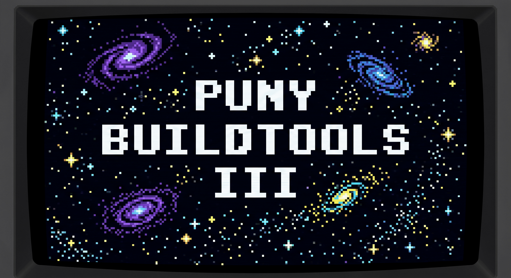

<p align="center">
  
</p>

# The Puny BuildTools

Welcome brave adventurer! If you're still into classic 8-bit / 16-bit home computers and Infocom style adventure games you may want to rest here for a while. The Puny BuildTools provide a command-line interface to [PunyInform](https://github.com/johanberntsson/PunyInform), a lightweight but powerful [Inform 6](https://github.com/DavidKinder/Inform6) library, optimized to perform well on old hardware. The Puny BuildTools assist interactive fiction authors as a project management solution for Infocom Z-machine games. They make the whole process of development fast, streamlined and accessible, from structuring your project to compilation, testing, building disk images for retro systems, converting pixel artworks to loading screens compatible with classic targets and bundling your releases for distribution.

## Contents

- [Quick start](#quick-start)
- [Build Targets](#build-targets)
- [Host](#host)
- [Installation](#installation)
- [The Puny CLI](#the-puny-cli)
- [An Author's Guide to the Galaxy](#an-authors-guide-to-the-galaxy)
- [Bonus Content](#bonus-content)
- [Hacks](#hacks)
- [Special notes on interpreters](#special-notes-on-interpreters)
- [Deprecated targets](#deprecated-targets)
- [Credits](#credits)
- [License](#license)

## Current version

`3.0` Starlit Path

## Quick start

Already on a `Debian 13 "Trixie"` host? (On `Windows` or `MacOS`, set up Debian first via WSL2 or OrbStack, see [Host](#host).) Install [PunyInform](https://github.com/johanberntsson/PunyInform), then run:

```
sudo apt install git && mkdir ~/FictionTools && cd ~/FictionTools && git clone https://github.com/ByteProject/Puny-BuildTools.git . && ./kenobi -i
```

That's it. That single command installs the Puny BuildTools **completely**: `kenobi -i` pulls in every dependency, detects your host system and configures your shell for you. Restart your terminal afterwards and you're ready to build, no further steps required.

Prefer to do it the hard way? The [Installation](#installation) chapter walks you through the guided installer in detail and, for those who like to suffer, documents the full manual installation as well.

## Build Targets

The following targets support Z-machine version 5 (XZIP) and Z-machine version 3 (ZIP) story files:

_C64, Amiga, Spectrum +3, Amstrad CPC/PCW, Atari ST, Atari 8-bit, MS-DOS, MSX, BBC Micro/Acorn Electron, C128, Plus/4, Apple II, SAM Coupe, TRS80 Model 3, TRS80 Model 4, TRS CoCo, Dragon 64, Mega65, Spectrum Next, Agon Light, Commander X16, classic Macintosh, modern PC._

> Note: Puny BuildTools projects by default are configured to target Z-machine version 5 and it's strongly recommended to keep it that way. The format is less restrictive and offers more options. The Z-machine version is defined in your project's config file. The BuildTools will ignore other Z-machine versions than 5 (default) or 3. Please consider that the Puny BuildTools are not intended to target mixed Z-machine versions. All targets will be built using the Z-machine version defined in your project's config file.

You can use the built-in feature to compile your story from source but the project workflow allows to skip this step and use any given story file.

There are also a few deprecated targets available, coincidentally only supporting Z-machine version 3:

_VIC20/PET, DEC Rainbow, Osborne1, Ti99/4a, Oric, Kaypro._

> Note: You can force to build the deprecated targets either one by one using the `-b` switch for `Puny CLI` or by using the `-d` switch when running the `all.sh` switch from your project root. See `Puny CLI` documentation. But beware: there are reasons why those systems are deprecated. You find these documented in the `Deprecated targets` section of this guide.

## Host

The Puny BuildTools are designed for `Linux (64-bit)` systems. They've been developed and extensively tested on `Debian`, which is the recommended system as it offers the most stability. Any derivate like `Ubuntu` should be fine though.

If you're on `Windows 10` (or later) you can run the Puny BuildTools via [WSL2](https://learn.microsoft.com/en-us/windows/wsl/about). Refer to the WSL2 docs on how to install Debian.

If you work on `MacOS`, I can't recommend [OrbStack](https://orbstack.dev/) enough. Make sure you set up a Debian machine with Intel architecture. The OrbStack documentation covers this topic well. Your Mac might require to have Rosetta installed.

## Installation

Below instructions are intended for `Debian 13 "Trixie"` (or later).

The Puny BuildTools come with a guided installer, which is part of the BuildTools updater tool `Puny-Wan Kenobi`. It takes care of the entire setup for you.

### Before you begin

The Puny BuildTools compile your games against the [PunyInform](https://github.com/johanberntsson/PunyInform) library, so install PunyInform first if you haven't already. Take note of the path to its `lib` directory, as the installer will ask you for it.

### 1. Get the BuildTools

The Puny BuildTools live in a folder named `FictionTools` in your home directory. You need `git` to fetch them, so open a Bash terminal and type:

```
sudo apt install git && mkdir ~/FictionTools && cd ~/FictionTools && git clone https://github.com/ByteProject/Puny-BuildTools.git .
```

### 2. Run the installer

Now let `Puny-Wan Kenobi` do the rest:

```
./kenobi -i
```

Kenobi guides you through the whole setup, asking for confirmation before any step that requires `sudo`. Step by step, it will:

- install all required dependencies
- detect your host system (native `Linux`, `MacOS` via OrbStack or `Windows / WSL2`) and configure your shell environment accordingly
- teach `cpmtools` to handle disk images for SAM Coupe and DEC Rainbow
- ask for the path to your PunyInform library
- verify that all components have the right permissions

The installer is safe to run again at any time. It only changes what isn't already in place, so you can re-run it after a system upgrade or a fresh checkout without messing up your setup.

### 3. Restart your terminal

Close all Terminal windows now and open a new Bash instance, so that the changes to your shell environment take effect. That's it, you've completed the setup!

> **If `./kenobi` won't run**: on rare occasions the executable bit may be missing, for example after copying files around locally without preserving permissions. Restore it and let Kenobi fix the rest, then run the installer again:
> ```
> chmod 755 kenobi && ./kenobi -p && ./kenobi -i
> ```

<details>
<summary><b>Manual installation</b> (advanced / for the curious)</summary>

You don't need any of this if you used `./kenobi -i`. It's documented here only so you know exactly what the installer does, and as a reference should you ever want to perform a step by hand.

Install the dependencies:

```
sudo apt update && sudo apt install frotz cpmtools dosfstools mtools git ruby imagemagick zip libsdl1.2debian libsdl2-2.0-0 python-is-python3 libgl1
```

Add the matching entry to your `~/.bashrc`. On `Linux`:

```
source ~/FictionTools/.punyrc
```

On `MacOS` (OrbStack):

```
source ~/FictionTools/.punyrc
source ~/FictionTools/.punyorb
```

On `Windows / WSL2`:

```
source ~/FictionTools/.punyrc
source ~/FictionTools/.punywsl
```

Teach `cpmtools` to handle disk images for SAM Coupe and DEC Rainbow by adding the following to `/etc/cpmtools/diskdefs` (edit it with `sudo nano /etc/cpmtools/diskdefs`):

```
diskdef prodos
  seclen 512
  tracks 160
  sectrk 9
  maxdir 256
  blocksize 2048
  boottrk 1
  skew 0
  os 2.2
end

# DEC2 DEC Rainbow - SSDD 96 tpi 5.25" - 512 x 10
  diskdef dec2
  seclen 512
  tracks 80
  sectrk 10
  blocksize 2048
  maxdir 128
  skew 2
  boottrk 2
  os 2.2
end
```

Finally, provide the path to your PunyInform `lib` directory by editing the `lib=` line in `~/FictionTools/.pi6rc`:

```
nano ~/FictionTools/.pi6rc
```

</details>

## The Puny CLI

The heart of the Puny BuildTools is a command-line interface called Puny CLI, which is accessible via the `puny` command. 

> Note: It's important that you execute the Puny CLI in your project's root directory.

The synopsis is:

`puny [-switch] or [-build target]`

A rule of thumb is: the switches are for managing your project, the build options with target arguments are meant to roll out your project on a variety of retro computer systems.

> Note: when this documentation talks about your "project" it actually refers to a game. A project is essentially a Z-machine game.

### Puny CLI: switches

The following switches are available.

#### puny -h

Show the help menu.

#### puny -i 

Initialize the project directory. This is the first thing you have to do before you can actually work with your project. It creates a set of files and directories:

> project root: all.sh, bundle.sh, config.sh

> /Releases directory: walkthrough.txt, invisiclues.txt, licenses.txt, PlayIF.pdf, readme.txt

> /Resources directory: pixel_guide.txt

How to work with the above project structure and its purpose is explained in the next chapter of this documentation.

#### puny -e

Opens an editor to set up the project configuration file `config.sh`, found in the project directory root. In practice, you do this step only once and directly after project initialisation.

#### puny -c

Compile your project to a Z-machine story file. Inform source file and Z-machine version are read from the variables defined in the project's config file. Will report an error if your story file cannot compile.

#### puny -a

Create highly optimized abbreviations. While this feature is optional, it's recommended to make use of it. Abbreviations are tokens of text compression. The better the compression, the smaller the story file, the higher the performance on retro computers. Please refer to the [abbreviations chapter](https://github.com/johanberntsson/PunyInform/wiki/manual#abbreviations) of the PunyInform manual to learn more about it. The optimized abbreviations are written to a file named `abbrvs.h` in the project directory, which you can import by adding `Include ">abbrvs.h";` to your Inform source file. Do so very early in your source as the Inform compiler is a one pass compiler, meaning strings found in your code before you include the abbreviations won't be compressed. You also need to add these lines of code at the very beginning of your source file:

```
!% $MAX_ABBREVS=96
!% $TRANSCRIPT_FORMAT=1
!% -r
!% -e
```

#### puny -t

Test your project. This feature is very useful while you're actively working on your game. What it really does: it compiles your latest source, then launches Frotz in your terminal window to test it. Will report and won't launch Frotz if a story file could not be generated due to a compilation error. In practice, you will use this feature a lot while your project progresses. It is the equivalent to "compile and run" in modern IDEs. 

#### puny -o

See the full range of target systems available for the build feature. Will also list the valid arguments you can pass after the build flag.

#### puny -s

Shows some examples of how you would use the Puny CLI.

#### puny -v

Shows version information for all components and modules of the Puny BuildTools.

### Puny CLI: building disk images

The most prominent feature of the Puny CLI is building disk images for a broad range of retro systems. It's designed to be as accessible as possible and a real time saver.

> Note: Make sure that you have the latest version of your project compiled, using `puny -c`. The build feature does not compile but instead takes the story file it finds in the project directory as a basis.

Let's say you'd love to have a Commodore Amiga version of your game. Essentially, all you need to do is this:

```
puny -b amiga
```

So you need to provide an argument after the build flag `-b argument`, which specifies the target system, in this case `-b amiga`. An overview of all supported targets and the equivalent arguments can be seen when launching with the -o switch `puny -o`.

The Puny CLI also supports the creation of multiple targets at once. Let's assume you want to create an Amiga, C64 and ZX Spectrum version of your game:

```
puny -b amiga -b c64 -b speccy
```

You'll find the resulting disk images right in your project folder. It's really that easy. And it can be even easier. When you initiated the project directory, an executable script `all.sh` has been placed in there as well. You can launch it with

```
./all.sh
```

and it will build all supported targets at once. To be more precise, it is configured to build all targets at once that support Z-machine version 5. The whole build process takes only a few seconds. You can edit the `all.sh` script of course to suit your needs. That's why the script is placed locally in your project's root folder, so you may alter it based on the project's scope. In case you want it to build the deprecated targets as well, run it with the `-d` switch, like this `./all.sh -d`. Deprecated targets are only available if targeting Z-machine version 3, so if you build your project for Z-machine 5, these are skipped anyway.

There is one more thing to know. You probably noticed the `Resources` folder that has been created when you initiated the project directory. Puny CLI will look into this folder upon building a target. When it finds a pixel artwork with the right format in it, Puny CLI will build a disk image for you with a proper loading screen. Not all targets support loading screens, but many targets do. If you look into the `Resources` folder, you'll find `pixel_guide.txt`, which explains in detail how to create the pixel artworks for all supported systems. 

> Note: Loading screens are purely optional. If you don't provide one in `Resources`, the target is built without. The Puny BuildTools support you in rapidly creating screens though for quite a few targets. Some great utilities have been crafted exclusively for the Puny BuildTools for said purpose. You'll learn more about them in the "Bonus Content" section of this documentation.

> Note: The Agon Light, MS-DOS and ZX Spectrum Next targets do not create disk images. Instead they place the output in folders `Agon`, `DOS` and `Next` respectively, inside the `Releases` folder in your project directory.

## An Author's Guide to the Galaxy

This part of the documentation aims to give you a real-life example of how one would work with the Puny BuildTools. Let's assume for a moment you have that great vision for your next best-selling interactive fiction epic called "The Galaxy".

The first thing you'll need to take care of is creating a project directory and navigate to it via `mkdir Galaxy && cd Galaxy`.

Next, initiate the project directory: `puny -i`. Afterwards, edit the configuration file with `puny -e`. In the editor view, change the STORY setting to `"galaxy"` and adjust SUBTITLE and LABEL to desired values. Save your changes.

Now would be the right time to add an Inform source file to your project folder. Name it `galaxy.inf`. In case you need a starting point, the examples that come with PunyInform are great. It's recommended that your game source has these compiler settings at the very beginning of the file:

```
!% -~S
!% $OMIT_UNUSED_ROUTINES=1
!% $MAX_ABBREVS=96
!% $TRANSCRIPT_FORMAT=1
!% $ZCODE_LESS_DICT_DATA=1
!% -r
!% -e
```

What happens now is solely based on your awesomeness. You start developing your game and you'll probably use the test feature `puny -t` a lot to "compile and run" your game until you're satisfied with it.

Once you're done, it's recommended to create optimized abbreviations with the `puny -a` switch. How to properly import these and make use of them has already been covered earlier in this documentation. 

So your game is done and the size of the story file has been optimized. Now it's about preparing the release. You decide to roll out your game on all supported retro systems, which means you don't need to alter the `all.sh` executable script in the project directory. And why would you. The more systems your story will be available for, the bigger the addressable target audience.

You choose to go the extra mile and provide loading screens, so you do as advised in `Resources/pixel_guide.txt`.

You use the `all.sh` script to create disk images for all supported systems.

In the `Releases` folder, which had been created when you initiated the project directory, you find a few files that you might want to alter. The file `readme.txt` contains loading instructions for all supported targets, but you may want to add additional content here, for example the gameplay or credits, really any information you want to player to receive together with your game. The files `walkthrough.txt` and `invisiclues.txt` are placeholders. You may replace them with an actual walkthrough and a set of InvisiClues-style hints for your game. If you'd rather not provide one or both, simply delete the file in question and it won't be added to the release bundle. The file `licenses.txt` needs to remain and you're not allowed to delete content from it. However, you are allowed to append a license text for your project to it, if applicable. The `PlayIF.pdf` card is a slightly improved version of the "Play IF" card Andrew Plotkin (Zarf) once made. If you don't want to distribute it with your game, you can delete it but I strongly recommend to keep it in as there are only advantages for the player when doing so. It also means that you don't need to focus too much on general mechanics in your manual / `readme.txt`.

> Note: It's important that you don't rename the files found in `Releases`, because otherwise they won't be added to the release bundle.

What a ride! Wouldn't it be nice and convenient if you could tell the Puny BuildTools to create a .ZIP file with all relevant contents of project, ready for distribution? That's exactly what the `bundle.sh` utility in your project directory is for. The synopsis is: 

`./bundle.sh -t path`

Let's say you want to place said .ZIP archive on your desktop. Simply do this:

```
./bundle.sh -t ~/Desktop
```

The file will be placed on your desktop and you can upload it to itch.io or wherever you want to distribute it.

How much time you save with the Puny BuildTools really becomes obvious once you need to update your code and distribute a new version of your game:

- change code 
- bump version number in config file 
- puny -c 
- ./all.sh 
- ./bundle.sh -t ~/Desktop

Apart from the code changes, you can do this in less than a minute. 

And that's it.

## Bonus Content

There is bonus content? Yes! The Puny BuildTools exclusively come with some additional, very useful applications. Let's have a closer look.

### pi6

pi6 is an Inform 6 command line wrapper, which uses the PunyInform library on your system to create story files. So instead of launching the Inform compiler itself, you can use pi6 instead. It's independent from project structures you create with Puny CLI. So if you quickly want to compile some Inform source to a story file without making it a project, that's what pi6 is for. The other major advantage is that it has a very straightforward synopsis compared to the Inform compiler. Building a story file from an Inform source file using the PunyInform library is as easy as this: 

```
pi6 galaxy.inf
```

This will create `galaxy.z5` in your current working directory. So by standard, pi6 creates Z-machine version 5 files. You may however create .z3 files with the -3 flag:

```
pi6 -3 galaxy.inf
```

If you launch `pi6` without an argument, it will show you the help menu.

### Puny-Wan Kenobi

I know, that's a very creative name. You've already been in touch with this powerful utility during the installation process. It has the capability to check if the Puny BuildTools have sufficient permissions on your system via `kenobi -c` and it is also capable to fix them. The feature you're probably going to use the most though is its ability to keep the Puny BuildTools up to date. Just type

```
kenobi -u
```

to fetch the latest updates. 

Type `kenobi -h` for the help menu.

### ifftool.sh

ifftool.sh is a MEGA65/Amiga IFF screen maker. It converts .PNG files to `.IFF` loading screens. The 16 color `screen16.iff` it produces is shared by both the MEGA65 and the Amiga targets, so a single image can serve both.

Type `ifftool.sh -h` for the help menu.

### cpcscr.sh

cpcscr.sh is an Amstrad CPC screen maker. It converts a .PNG image file to an Amstrad CPC loading screen, a colour palette file and a BASIC loader. The output will be: `SCREEN.SCR`, `SCREEN.PAL` and `SCREEN.BAS`.

Type `cpcscr.sh -h` for the help menu.

### degaspi1.sh

degaspi1.sh is, as the name implies, an Atari ST (Degas .PI1) screen maker. It converts .PNG images to Atari ST / Degas .PI1 format.

### makescr.sh

makescr.sh is a ZX Spectrum screen maker. Please refer to the `pixel_guide.txt` found in the `Resources` folder of your project to learn how to use it.

### nextscr.sh

nextscr.sh is a ZX Spectrum Next screen maker. It converts a .BMP image file (16-256 colors, 320x256 pixels, 8-bit) to a Spectrum Next loading screen in .NXI format. The output will be `screen.nxi`.

Type `nextscr.sh -h` for the help menu.

### The 'punycustom' folder

By default, the folder `punycustom` does not exist. However, if you find the feature useful, you may create it via 

```
mkdir ~/FictionTools/punycustom
```

So what does it do? Let's assume for a moment that you want to replace a PunyInform library file. Not just a few routines but the whole file. That's what it is for. Every file you place in `punycustom` that has the same name as a PunyInform library file, is used upon compilation instead. The most common scenario would be replacing the library's standard messages found in `messages.h` with your own implementation. Another common scenario would be replacing one of the PunyInform library extensions with a customized version.

## Hacks

Hacks are settings which you can add to the configuration file of your project to override the default behavior of the Puny BuildTools. All hacks are case-sensitive.

#### APPLE2_Z3_INFOCOM=true
Builds Apple II Z-machine version 3 targets with Infocom's interpreter version K instead of Vezza. This hack is ignored if `ZVERSION 5` is defined in your project's configuration file.

#### APPLE2_Z5_INFOCOM=true
Builds Apple II Z-machine version 5 targets with Infocom's own Apple II z5 interpreter instead of Vezza. Infocom's original release of this interpreter was buggy. The one used here is a community-repaired version of it. Since it has been modified and is provided as-is, use it at your own risk. That's why it is offered as a hack rather than as the default interpreter. Its main advantage is that it runs without a CP/M card, whereas the default Apple II z5 build boots from a CP/M system disk. If the interpreter and your story together exceed a single disk, the build automatically produces a two-disk set instead (`<story>_apple2_s1.dsk` and `<story>_apple2_s2.nib`). Note that the second disk is a headerless nibble image, which works in emulators such as AppleWin but is not suited for writing to physical media. This hack is ignored if `ZVERSION 3` is defined in your project's configuration file.

## Special notes on interpreters

### Blank save disks for CoCo and Dragon 64

The TRS-80 Color Computer 1/2 and the Dragon 64 support saving and restoring your game progress to a dedicated save disk. The bundled `mkdsk.py` utility can create a blank, formatted save disk for both machines.

For the CoCo, create a blank RS-DOS save disk like this:

```
mkdsk.py -o save.dsk --blank
```

For the Dragon 64, create a blank DragonDOS save disk like this:

```
mkdsk.py -o save.vdk --dragon --blank
```

### Ceres on CoCo and Dragon 64

When targeting Z-machine version 5, the TRS-80 Color Computer 1/2 and the Dragon 64 are powered by `Ceres`, a clean-room Z-machine version 5 interpreter. On the Dragon 64, the version 5 disk is a single self-booting image: the player just inserts it and types `BOOT`. On the CoCo, the version 5 disk boots with `RUN"CERES"`. Both targets still support Z-machine version 3 as well. Their disk images are built with the bundled `mkdsk.py`, a self-contained Python utility that needs no further dependencies.

### Eris on the Amiga and Atari ST

When targeting Z-machine version 5, the Commodore Amiga and the Atari ST are powered by `Eris`, a clean-room Z-machine version 5 interpreter sharing one core across both machines. It runs on a stock Amiga (A500, Kickstart 1.3) and a stock Atari ST (520STF), needs no Workbench or hard disk, and supports international/accented characters and the full range of Z-machine text styles, with save and restore to a separate save disk. The disks are self-booting and built from scratch by the bundled Python tools `adf.py` (Amiga) and `gemdos.py` (Atari ST), with no further dependencies. The Z-machine version 3 path still wraps Infocom's own Amiga and Atari ST interpreters.

On the Atari ST, when you supply a colour loading screen (`Resources/screen.pi1`), the builder automatically derives a monochrome version too, so the artwork shows on both colour and monochrome monitors. On the Amiga the loading screen (`Resources/screen16.iff`) is the same format the MEGA65 target uses, so a single screen can serve both.

### Save disks for the Amiga and Atari ST

Eris keeps saved games on a separate disk, never on the game disk, and the two machines need different kinds of save disk.

On the Atari ST, saves are ordinary GEMDOS files, so the save disk must be a formatted FAT12 volume. `gemdos.py` builds a blank one for you when you pass `--out` without a story or interpreter:

```
gemdos.py --boot ~/FictionTools/Templates/Interpreters/st_boot.bin --out save.st
```

On the Amiga, Eris boots without AmigaDOS and uses its own raw disk layout, so the save disk needs no filesystem at all. Any blank 880K image works and Eris formats it on the first save:

```
python3 -c "open('save.adf','wb').write(bytes(901120))"
```

## Deprecated targets

Some of the build targets are deprecated and flagged as such in Puny CLI. I've tried to document the reasons why below. Note that the issues listed per system are not considered complete and you may encounter even more issues. You can force building deprecated targets either one-by-one using Puny CLI or using the `-d` flag when running the `all.sh` script in your project dir like this `./all.sh -d`.

> Disclaimer: use deprecated targets at your own risk and don't come at me if something is not working as intended. It's recommended to only use build targets which are not flagged as deprecated in Puny CLI, since these have been tested well and offer a proven track of reliability.

<details>
<summary><b>Per-system notes</b> (why each target is deprecated)</summary>

- VIC-20 / PET: Very slow third-party interpreter. Won't offer a good experience to players. You'll also need at least 32kb of RAM. On VIC-20, this requires you to plug in a memory-expansion cartridge. On PET, you may need to upgrade the built-in RAM to 32kb. So your game won't run out of the box on these machines.

- DEC Rainbow 100: Due to the lack of emulators, this interpreter is completely untested and for that, cannot be recommended. This is the only interpreter that Infocom ever released for the DEC Rainbow and it is a very old interpreter. The last game that Infocom released for this machine was Infidel. If you, by any chance, get this running, I would expect bugs. 

- Osborne 1: This is a generic CPM interpreter which does not offer a statusline. Note that Osborne1 disks are very small (only 91kb) and you need to subtract the interpreter and some system files from that value. If your story file exceeds 68k, it makes no sense to build this target.

- TI99/4a: Infocom stopped supporting the TI99 very early. This target uses a third-party interpreter which generally works okay if you stick to its limitations. If your story file is below 52k, the game won't run. Anything above 98k could also be problematic. Some story files I tested did not work, some did. I never got my head around why.

- Oric: This interpreter generally works well but would require more testing. And it needs a modified drive in case you want to play this on real hardware. Fine to use with emulators though.

- Kaypro: Generic third-party CPM interpreter which doesn't offer a statusline. I found this interpreter on the internet but I was never able to actually test it on a Kaypro machine. The disk image cannot be loaded in an emulator since the Kaypro emulators out there only support awkward formats and not the output generated cpmtools.

</details>

## Credits

Special thanks to Shawn Sijnstra, Fredrik Ramsberg, Johan Berntsson, Andrew Plotkin, Graham Nelson, Marco Innocenti, the community on the Puny Discord server, the authors of all the free and open-sourced utilities being used in the backend of the Puny BuildTools, those great individuals who directly or indirectly contributed to this project, Sebastian Bach from PolyPlay, Ant Stiller, the ZZAP!64 crew, Jason Scott and most importantly the great masters themselves, once known as Infocom.

## License

The Puny BuildTools are released under a modified BSD 2-clause license. I strongly encourage you to read the file `LICENSE.md` before you start working with the project.

Any free or open-sourced software distributed with the Puny BuildTools not written by Stefan Vogt, retains the copyright and license under which it had been released.
